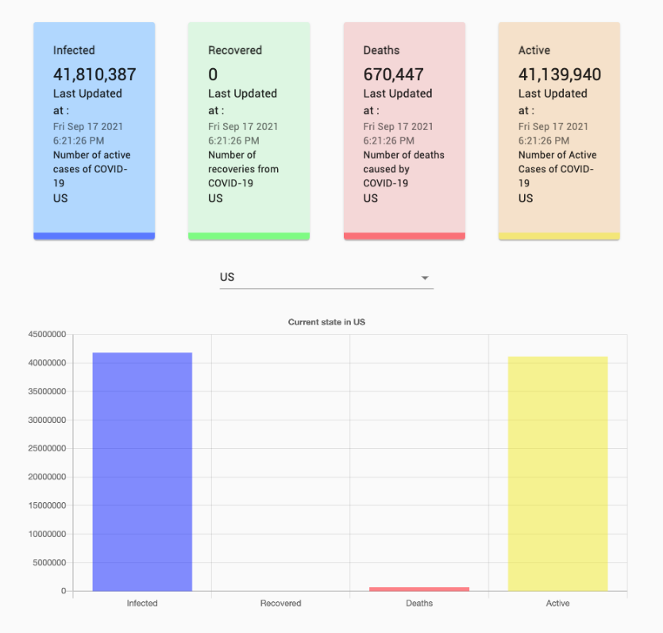

# COVID-19 TRACKER
Aşağıdaki ekran görüntüsünde gördüğünüz çalışmaya benzer bir Covid 19 takip uygulaması geliştirmeniz gerekiyor.

## Gereksinimler
- Enfekte olan, iyileşen, ölen ve aktif hasta sayısını ekrana yerleştireceğiniz dört kart ile göstermeniz gerekiyor. Ayrıca bu kartlarda son güncellenme tarihlerini de gösterebilirsiniz.
- Başlangıçta tüm dünya genelindeki veriler gösterilmelidir.
- Kartların hemen altına yerleştireceğiniz bir dropdown içerisinde ülkeleri listelemeniz gerekiyor. Buradan seçilen herhangi ülkenin detay bilgileri görüntülenebilmelidir.
- Sayfanın altına yerleştireceğiniz bölümde ise verileri grafik olarak göstermeniz gerekiyor.